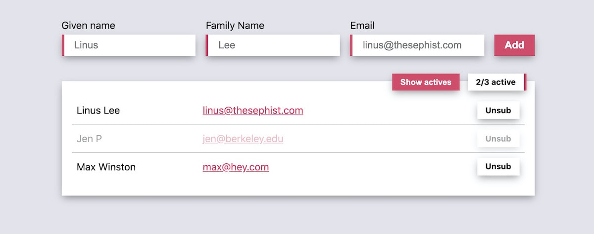

# Lovecroft 💌

Lovecroft is a minimal mailing list manager supporting multiple mailing lists. It backs newsletters behind [thesephist.com](https://thesephist.com) and [Atypical Press](https://atypicalpress.com). Lovecroft acts as a common backend for static sites that need to host email subscriptions, and exposes a cross-origin JSON API for enrolling in and unsubscribing from mailing lists.



## JSON API

### POST `/subscribe/{listName}`

```ts
{
    givenName: string,
    familyName: string,
    email: string,
}
```

### GET `/unsubscribe/{listName}/{token}`